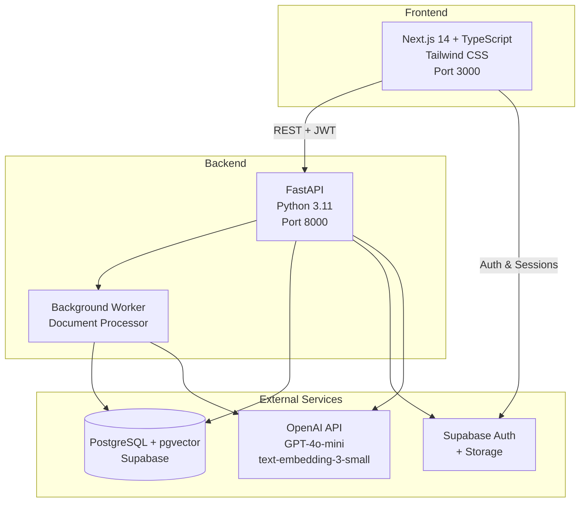
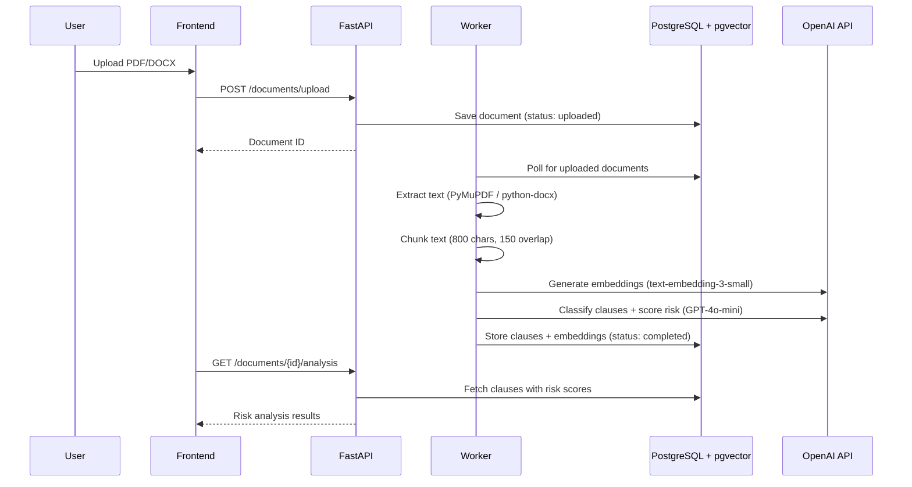

# ContractLens

AI-powered contract review and risk analysis platform. Upload legal documents (PDF, DOCX), get automatic clause classification, risk scoring, semantic search, and version comparison — powered by LLMs and vector embeddings.

## Architecture



## Features

- **Document Upload** — Drag-and-drop PDF/DOCX upload with validation (10MB limit)
- **AI-Powered Clause Classification** — Automatic detection of 14 clause types (Indemnification, Termination, Confidentiality, IP, Payment Terms, etc.)
- **Risk Scoring** — Four-level risk assessment (Critical / High / Medium / Low) with explanations
- **Semantic Search** — Vector-based search across document clauses using pgvector + HNSW index
- **Version Comparison** — Text diff and semantic diff between document versions with risk delta calculation
- **Authentication** — JWT-based auth with Supabase Auth (cookie-based sessions, route protection)

## Tech Stack

| Layer | Technology |
|-------|-----------|
| **Frontend** | Next.js 14 (App Router), TypeScript, Tailwind CSS, Lucide React |
| **Backend** | FastAPI, Python 3.11, SQLAlchemy (async), psycopg3 |
| **AI/ML** | OpenAI API — GPT-4o-mini (classification), text-embedding-3-small (embeddings) |
| **Database** | PostgreSQL + pgvector (Supabase) with HNSW vector index |
| **Auth & Storage** | Supabase Auth (@supabase/ssr) + Supabase Storage |
| **Document Parsing** | PyMuPDF (PDF), python-docx (DOCX), LangChain (chunking) |
| **Monitoring** | Sentry (error tracking, both frontend and backend) |
| **Containerization** | Docker + Docker Compose |

## How It Works

### Document Processing Pipeline



### Semantic Search

1. User query is embedded via OpenAI text-embedding-3-small
2. pgvector performs cosine similarity search using HNSW index
3. Results filtered by user's documents and ranked by relevance score

### Version Comparison

1. Text diff using Python `difflib` (additions, deletions, modifications)
2. Semantic clause matching via embedding similarity (same / modified / added / removed thresholds)
3. Risk delta calculation between versions

## Project Structure

```
contractlens/
├── backend/
│   ├── app/
│   │   ├── api/              # REST endpoints (documents, search, comparison)
│   │   ├── core/             # Config, auth, middleware, database
│   │   ├── models/           # SQLAlchemy models (document, clause, user)
│   │   ├── services/         # Business logic (extraction, chunking, embedding,
│   │   │                     #   classification, search, comparison)
│   │   └── workers/          # Background document processor
│   ├── migrations/           # SQL schema migrations
│   ├── tests/                # pytest test suite
│   ├── Dockerfile
│   └── pyproject.toml
├── frontend/
│   ├── src/
│   │   ├── app/              # Next.js pages (dashboard, search, compare)
│   │   ├── components/       # React components
│   │   ├── lib/              # API client, Supabase client, utilities
│   │   └── types/            # TypeScript definitions
│   └── package.json
├── docs/
│   ├── architecture.md       # Detailed architecture documentation
│   └── adr/                  # Architecture Decision Records
├── docker-compose.yml
└── .env.example
```

## API Endpoints

| Method | Endpoint | Description |
|--------|----------|-------------|
| POST | `/api/v1/documents/upload` | Upload PDF/DOCX document |
| GET | `/api/v1/documents` | List user's documents |
| GET | `/api/v1/documents/{id}` | Get document details |
| GET | `/api/v1/documents/{id}/analysis` | Get risk analysis with clauses |
| DELETE | `/api/v1/documents/{id}` | Delete document |
| GET | `/api/v1/documents/{id}/versions` | List document versions |
| POST | `/api/v1/documents/{id}/versions` | Upload new version |
| GET | `/api/v1/search?q=...` | Semantic search across clauses |
| GET | `/api/v1/search/similar/{clause_id}` | Find similar clauses |
| GET | `/api/v1/compare?version1=...&version2=...` | Compare two versions |
| GET | `/health` | Health check |

All endpoints except `/health` require JWT authentication via `Authorization: Bearer <token>` header.

API docs (Swagger UI) available at `http://localhost:8000/docs` when running locally.

## Getting Started

### Prerequisites

- Python 3.11+
- Node.js 20+
- [Supabase](https://supabase.com) account (free tier works)
- [OpenAI](https://platform.openai.com) API key

### Setup

1. **Clone the repository**
   ```bash
   git clone https://github.com/vijay-prabhu/contractlens.git
   cd contractlens
   ```

2. **Configure environment variables**
   ```bash
   # Backend
   cp .env.example .env
   # Edit .env with your Supabase and OpenAI credentials

   # Frontend
   cp frontend/.env.example frontend/.env.local
   # Edit frontend/.env.local with your Supabase public keys
   ```

3. **Set up the database**
   - Run the SQL files from `backend/migrations/` in the Supabase SQL editor
   - Enable the `vector` extension in Supabase (Extensions page)

4. **Run with Docker Compose**
   ```bash
   docker compose up
   ```

   Or run manually:

   ```bash
   # Terminal 1 — Backend
   cd backend
   poetry install
   poetry run uvicorn app.main:app --reload --port 8000

   # Terminal 2 — Frontend
   cd frontend
   npm install
   npm run dev
   ```

5. Open http://localhost:3000

## Testing

```bash
cd backend
poetry run pytest -v

# With coverage
poetry run pytest --cov=app --cov-report=html
```

38 tests covering auth, documents, search, and comparison.

## Architecture Decisions

Key technical decisions are documented as ADRs:

- [ADR-001: Technology Stack Selection](docs/adr/ADR-001-technology-stack.md)
- [ADR-002: Vector Index Selection — HNSW vs ivfflat](docs/adr/ADR-002-vector-index-selection.md)
- [ADR-003: LLM Classification Strategy](docs/adr/ADR-003-llm-classification-strategy.md)
- [ADR-004: Version Comparison Strategy](docs/adr/ADR-004-version-comparison-strategy.md)
- [ADR-005: Real-time Architecture](docs/adr/ADR-005-realtime-architecture.md)

## License

[MIT](LICENSE)
