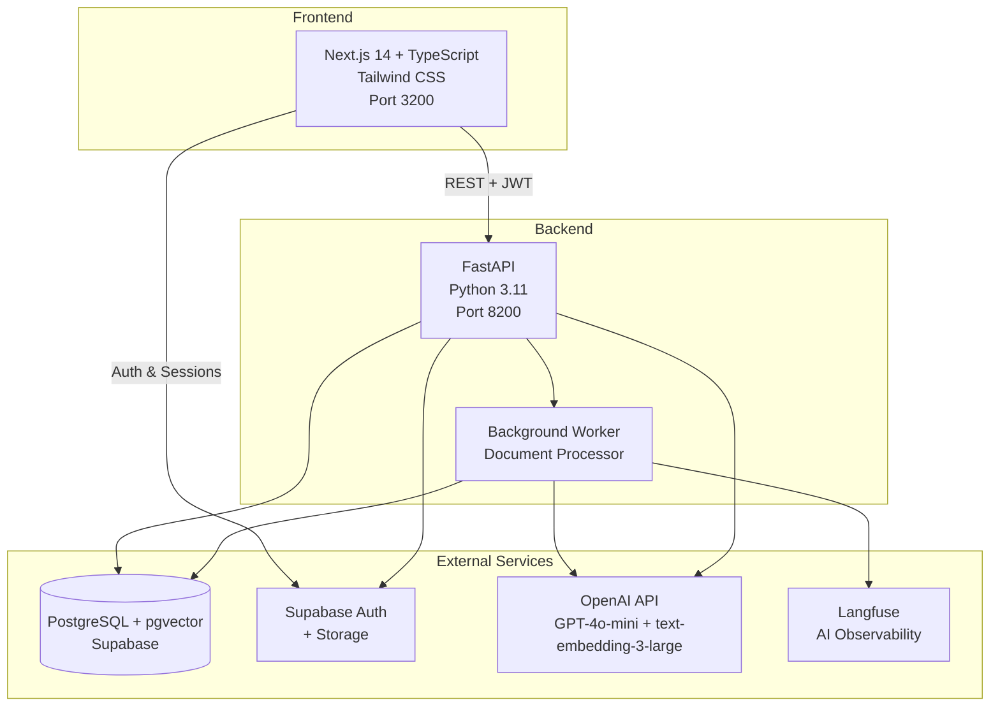

# ContractLens

[](LICENSE)
[](https://python.org)
[](tests/evaluation/)

I built ContractLens to make contract review faster. Upload a PDF or DOCX, and it classifies every clause, scores the risk, and lets you search across all your contracts semantically. Compare two versions of the same contract and see exactly what changed and whether risk went up or down.

## Architecture



## Features

- **Document Upload** - Drag-and-drop PDF/DOCX with validation (10MB limit)
- **23 Clause Types** - Automatic classification including indemnification, non-compete, data protection, limitation of liability, termination, IP, and more. Taxonomy is config-driven from YAML.
- **Risk Scoring** - CVSS-inspired formula. Four levels (Critical / High / Medium / Low) with per-clause explanations and recommendations.
- **Semantic Search** - Vector search across all your clauses using pgvector + HNSW index
- **Version Comparison** - Text diff + semantic matching between versions. Shows added, removed, modified clauses with risk trend detection.
- **Structured Outputs** - GPT-4o-mini with Pydantic schema enforcement. Zero JSON parse failures. Few-shot examples for calibration.
- **AI Observability** - Langfuse traces every LLM call with token counts, cost, and latency
- **AI Security** - Input sanitization against prompt injection, output anomaly detection
- **Evaluation Framework** - 29-clause gold standard, 96.6% type accuracy baseline, CI/CD quality gates

## Tech Stack

| Layer | Technology |
|-------|-----------|
| **Frontend** | Next.js 14 (App Router), TypeScript, Tailwind CSS, Lucide React |
| **Backend** | FastAPI, Python 3.11, SQLAlchemy (async), psycopg3 |
| **AI/ML** | OpenAI API - GPT-4o-mini-2024-07-18 (classification), text-embedding-3-large (embeddings) |
| **Database** | PostgreSQL + pgvector (Supabase) with HNSW vector index |
| **Auth & Storage** | Supabase Auth (@supabase/ssr) + Supabase Storage |
| **Document Parsing** | Docling (primary, structured output), PyMuPDF (fallback) |
| **Monitoring** | Sentry (errors), Langfuse (AI observability), GitHub Actions (eval CI/CD) |
| **Containerization** | Docker + Docker Compose |

## How It Works

### Document Processing Pipeline


### Semantic Search

1. User query embedded via OpenAI text-embedding-3-large
2. pgvector cosine similarity search with HNSW index (latest version only)
3. Results filtered by user's documents, ranked by relevance (min similarity 0.5)

### Version Comparison

1. Text diff using Python `difflib` (additions, deletions, modifications)
2. Semantic clause matching via pgvector nearest-neighbor (unchanged / modified / added / removed)
3. CVSS-inspired risk scoring with relative trend detection and escalation tracking

## Project Structure

```
contractlens/
├── backend/
│   ├── app/
│   │   ├── api/              # REST endpoints + DI factories
│   │   ├── core/             # Config, auth, constants, security, taxonomy
│   │   ├── models/           # SQLAlchemy models (document, clause, user)
│   │   ├── services/         # Docling extraction, section chunking, embedding,
│   │   │                     #   classification, risk scoring, search, comparison
│   │   └── workers/          # Background document processor
│   ├── config/               # clause_types.yaml (taxonomy source of truth)
│   ├── migrations/           # SQL schema migrations
│   ├── scripts/              # Bulk reprocessing
│   └── pyproject.toml
├── frontend/
│   ├── src/
│   │   ├── app/              # Next.js pages (dashboard, search, compare)
│   │   ├── components/       # React components
│   │   ├── lib/              # API client, constants, Supabase client, utilities
│   │   └── types/            # TypeScript definitions
│   └── package.json
├── tests/
│   └── evaluation/           # Gold standard test set + eval script
├── docs/
│   ├── architecture.md       # Detailed architecture documentation
│   ├── roadmap-v2.md         # v2 roadmap
│   └── adr/                  # 15 Architecture Decision Records
├── .github/workflows/        # CI/CD eval gate
├── dev-start.sh              # Start backend + frontend locally
├── dev-stop.sh               # Stop all local services
├── dev-logs.sh               # Tail service logs
├── AGENTS.md                 # AI agent instructions (Claude Code, Cursor, etc.)
├── CONTRIBUTING.md            # Contributor guide
├── docker-compose.yml
└── .env.example
```

## API Endpoints

| Method | Endpoint | Description |
|--------|----------|-------------|
| POST | `/api/v1/documents/upload` | Upload PDF/DOCX document |
| GET | `/api/v1/documents` | List user's documents |
| GET | `/api/v1/documents/{id}` | Get document details |
| GET | `/api/v1/documents/{id}/analysis` | Get risk analysis with clauses |
| DELETE | `/api/v1/documents/{id}` | Delete document |
| GET | `/api/v1/documents/{id}/versions` | List document versions |
| POST | `/api/v1/documents/{id}/versions` | Upload new version |
| GET | `/api/v1/search?q=...` | Semantic search across clauses |
| GET | `/api/v1/search/similar/{clause_id}` | Find similar clauses |
| GET | `/api/v1/compare?version1=...&version2=...` | Compare two versions |
| GET | `/health` | Health check |

All endpoints except `/health` require JWT authentication via `Authorization: Bearer <token>` header.

API docs (Swagger UI) at `http://localhost:8200/docs` when running locally.

## Getting Started

### Prerequisites

- Python 3.11+
- Node.js 20+
- [Supabase](https://supabase.com) account (free tier works)
- [OpenAI](https://platform.openai.com) API key

### Setup

1. **Clone the repository**
   ```bash
   git clone https://github.com/vijay-prabhu/contractlens.git
   cd contractlens
   ```

2. **Configure environment variables**
   ```bash
   cp .env.example .env
   cp frontend/.env.example frontend/.env.local
   # Edit both files with your Supabase and OpenAI credentials
   ```

3. **Set up the database**
   - Run the SQL files from `backend/migrations/` in the Supabase SQL editor
   - Enable the `vector` extension in Supabase (Extensions page)

4. **Run locally**
   ```bash
   # Install dependencies (first time only)
   cd backend && poetry install && cd ..
   cd frontend && npm install && cd ..

   # Start all services
   ./dev-start.sh

   # Stop all services
   ./dev-stop.sh

   # View logs
   ./dev-logs.sh [backend|frontend]
   ```

   Or run with Docker Compose:

   ```bash
   docker compose up
   ```

5. Open http://localhost:3200

## Classification Accuracy

Measured against a 29-clause gold standard from a real technology services agreement:

| Metric | Score |
|--------|-------|
| Clause type accuracy | 96.6% |
| Risk level accuracy | 93.1% |
| Score in range | 96.6% |
| Failure rate | 0% |

Run the evaluation yourself:
```bash
cd backend && poetry run python ../tests/evaluation/evaluate.py --save
```

## Architecture Decisions

15 ADRs document every major technical decision:

- [ADR-001: Technology Stack](docs/adr/ADR-001-technology-stack.md)
- [ADR-002: Vector Index Selection](docs/adr/ADR-002-vector-index-selection.md)
- [ADR-003: LLM Classification Strategy](docs/adr/ADR-003-llm-classification-strategy.md)
- [ADR-004: Version Comparison Strategy](docs/adr/ADR-004-version-comparison-strategy.md)
- [ADR-005: Real-time Architecture](docs/adr/ADR-005-realtime-architecture.md)
- [ADR-006: Configurable Clause Taxonomy](docs/adr/ADR-006-configurable-clause-taxonomy.md)
- [ADR-007: Classification Pipeline Optimization](docs/adr/ADR-007-classification-pipeline-optimization.md)
- [ADR-008: Risk Scoring Methodology](docs/adr/ADR-008-risk-scoring-methodology.md)
- [ADR-009: Classification Quality](docs/adr/ADR-009-classification-quality.md)
- [ADR-010: Document Parsing & Chunking](docs/adr/ADR-010-document-parsing-and-chunking.md)
- [ADR-011: Evaluation Framework](docs/adr/ADR-011-evaluation-framework.md)
- [ADR-012: Embedding Model Upgrade](docs/adr/ADR-012-embedding-model-upgrade.md)
- [ADR-013: AI Observability](docs/adr/ADR-013-ai-observability.md)
- [ADR-014: AI Security](docs/adr/ADR-014-ai-security.md)
- [ADR-015: CI/CD Evaluation Gate](docs/adr/ADR-015-ci-cd-eval-gate.md)

## Contributing

See [CONTRIBUTING.md](CONTRIBUTING.md) for setup, code style, and PR process.

## License

[MIT](LICENSE)
